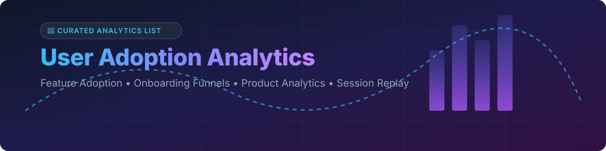

  

<h1 align="center">📊 Awesome User Adoption Analytics 🚀</h1>

  <strong>A curated list of top SaaS platforms and open-source GitHub projects for user adoption, product analytics, feature tracking, onboarding funnels, and session replay.</strong>

  
  
  
  
  

---

## 💡 Overview & Ecosystem

This repository tracks notable **commercial user adoption analytics platforms** and **open-source software** designed to measure user behavior, feature discovery, retention cohorts, onboarding checklists, and session replay — from enterprise Digital Adoption Platforms (DAP) to lightweight self-hosted analytics engines.

Whether you are looking for self-hosted product analytics tools like **PostHog**, **Matomo**, or **Umami**, or evaluating commercial category leaders like **Mixpanel**, **Pendo**, and **WalkMe**, this list provides structured comparisons including pricing, free tier limits, star metrics, and enterprise market positioning.

> 📅 **Last updated:** October 2026

---

## 📑 Table of Contents

- [🏢 SaaS & Hosted Platforms](#-saas--hosted-platforms)
- [🔓 Open-Source GitHub Projects](#-open-source-github-projects)
  - [📈 Product & Web Analytics Platforms](#-product--web-analytics-platforms)
  - [📹 Session Replay & Behavioral Analytics](#-session-replay--behavioral-analytics)
  - [🎯 In-App Guidance, Onboarding & Product Tours](#-in-app-guidance-onboarding--product-tours)
- [🤝 How to Contribute](#-how-to-contribute)
- [💖 Support & Sponsorship](#-support--sponsorship)
- [📈 Star History](#-star-history)
- [⚠️ Disclaimer](#%EF%B8%8F-disclaimer)

---

## 🏢 SaaS & Hosted Platforms

The global Digital Adoption Platform (DAP) and Product Analytics market is estimated at **$4.5 Billion to $6.0 Billion** (growing at ~16% CAGR). The market is **moderately fragmented**: enterprise DAPs (*WalkMe*, *Whatfix*) and product analytics giants (*Mixpanel*, *Pendo*, *Salesforce*) co-exist alongside product-led growth onboarding tools without a single winner-take-all monopoly.

| Product / Platform | Market Size / Valuation / Revenue | Starting Price | Free Tier Limit / Trial | Key Features & Best Use Case |
| :--- | :--- | :--- | :--- | :--- |
| **[Salesforce Adoption Dashboards](https://www.salesforce.com/)** | **$187B - $222B Valuation** ($41.5B FY26 Revenue) | Included with Salesforce licenses | Included with Salesforce subscription (14-day free trial for orgs) | ⚡ **Salesforce native adoption analytics** — tracks Lightning Experience adoption, feature usage, and user activity within Salesforce. *Best for Salesforce customers.* |
| **[Pendo](https://www.pendo.io/)** | **$2.6B Valuation** (~$300M Revenue) | Custom quotes (~$7,000/yr entry paid tiers) | **Free forever for up to 500 Monthly Active Users (MAUs)** | 📊 **Product analytics-first platform with in-app guides** — combines usage analytics, NPS, user segmentation, and in-app guidance in one tool. *Best for product teams wanting analytics & guidance.* |
| **[WalkMe](https://www.walkme.com/)** | **$1.5B Acquisition / Valuation** (Acquired by SAP; $267M Revenue) | Custom quotes (starts at ~$1,500/mo or $18,000/yr) | **No free tier for core DAP** (WalkMe Learning Arc offers 30-day free trial; sales POC for DAP) | 🚶 **Pioneer and market leader in Digital Adoption Platforms (DAP)** — enterprise-grade platform covering employee onboarding, customer onboarding, process automation, and analytics. *Best for enterprise DAP deployments.* |
| **[Gainsight PX](https://www.gainsight.com/product-experience/)** | **$1.1B - $2.5B Valuation** ($200M-$500M Revenue) | Custom quotes (~$1,200/yr per user estimate) | **Free trial available for Gainsight PX** (CS Cloud requires sales demo/POC) | 📈 **Product experience platform** (formerly Aptrinsic) — product analytics with in-app engagement and customer success integration. *Best for customer success teams.* |
| **[Mixpanel](https://mixpanel.com/)** | **$1.05B Valuation** (~$127M ARR Revenue) | **$24/month** (Growth plan) | **Free forever for up to 1,000,000 events/month** | 🔍 **Product analytics platform** — event-based analytics with funnels, retention, flows, and user profiles. *Best for product analytics at scale.* |
| **[Whatfix](https://whatfix.com/)** | **$900M Valuation** (~$138.8M Revenue) | Custom quotes (~$2,000/mo or $24,000/yr estimate) | **No free tier** (Requires sales-led custom Proof of Concept / demo) | 💡 **Enterprise DAP known for ease of use and support widgets** — strong for Salesforce, SuccessFactors, ServiceNow, and Oracle deployments. Offers on-premise deployment. *Best for enterprise application adoption.* |
| **[Appcues](https://www.appcues.com/)** | **$200M - $300M Est. Valuation** (~$16.7M ARR Revenue) | **$249/month** (Essentials plan) | **14-day free trial** (No credit card required) | 🎨 **Product-led growth platform with no-code onboarding flows** — in-app messaging, NPS, and mobile SDKs. *Best for SaaS companies wanting self-serve onboarding.* |
| **[Userpilot](https://userpilot.com/)** | **$30M - $50M Est. Valuation** (~$9.5M ARR Revenue) | **$299/month** (Starter plan up to 2,000 MAUs) | **14-day free trial** (Full feature access during trial) | 🚀 **Product growth platform with onboarding checklists and feature adoption analytics** — popular with B2B SaaS companies. *Best for mid-market SaaS.* |
| **[UserIQ](https://useriq.com/)** | *Defunct* (Ceased operations May 2022; raised $18.7M total) | Service discontinued | Service discontinued (Shut down on May 10, 2022) | ❌ **Customer success & adoption platform** — product adoption analytics with in-app engagement and health scoring. *Out of business; listed for historical reference.* |

---

## 🔓 Open-Source GitHub Projects

The open-source ecosystem provides powerful self-hosted alternatives for event tracking, product analytics, session replay, and in-app tours.

### 📈 Product & Web Analytics Platforms

*Sorted by GitHub_Stars (Descending)*

- **[Umami](https://github.com/umami-software/umami)**   
  ⚡ **Privacy-friendly web & product analytics**, MIT licensed. Simple, fast, non-cookie analytics with Docker support. *Best for lightweight adoption tracking.*

- **[Driver.js](https://github.com/kamranahmedse/driver.js)**   
  🎯 **Lightweight product tours and feature highlighting library**, MIT licensed. Only 3KB gzipped with zero dependencies. Used by Red Hat, GitKraken, and Fiverr. *Best for feature adoption highlighting.*

- **[PostHog](https://github.com/PostHog/posthog)**   
  🦔 **The most complete open-source product analytics suite**, MIT licensed. Combines Product Analytics (funnels, retention, paths, cohorts), Session Replay, Feature Flags, A/B Testing, Surveys, and Data Warehouse in one deployable stack. *De facto open-source Amplitude/Mixpanel alternative.*

- **[Matomo](https://github.com/matomo-org/matomo)**   
  🌐 **Full-featured web analytics platform**, GPL-3.0 licensed. Offers session recording, heatmaps, A/B testing, funnels, and goal tracking with strict GDPR privacy compliance. *Best privacy-first Google Analytics alternative.*

- **[Plausible Analytics](https://github.com/plausible/analytics)**   
  🌱 **Lightweight, privacy-focused open-source analytics**, AGPL-3.0 licensed. No cookies, no tracking across websites, clean real-time dashboard. *Best for simple adoption metrics.*

- **[Shepherd.js](https://github.com/shipshapecode/shepherd)**   
  🐑 **Framework-agnostic user onboarding tour library**, MIT licensed. Clean imperative API with smooth scrolling and element positioning. *Best for flexible onboarding walkthroughs.*

- **[Intro.js](https://github.com/usablica/intro.js)**   
  ✨ **Established product tour library**, AGPL-3.0 licensed. Uses `data-intro` HTML attributes for quick onboarding guides. *Best for traditional web applications.*

- **[React Joyride](https://github.com/gilbarbara/react-joyride)**   
  ⚛️ **Guided tours library for React applications**, MIT licensed. Flexible step management and custom tooltip rendering. *Best for React apps.*

- **[Countly](https://github.com/Countly/countly-server)**   
  📱 **Product analytics & push notifications platform**, GPL-3.0 licensed. Tracks web and mobile adoption funnels with crash reports and behavioral analytics. *Best for mobile product adoption.*

- **[Ackee](https://github.com/electrolyt/ackee)**   
  🔒 **Self-hosted Node.js analytics software**, MIT licensed. Privacy-focused analytics operating on a GraphQL API. *Best for Node.js developers.*

- **[Swetrix](https://github.com/Swetrix/swetrix-fe)**   
  🛡️ **Open-source, cookie-less web analytics**, AGPL-3.0 licensed. Includes browser extensions, custom event tracking, and performance metrics. *Best for cookieless user tracking.*

- **[Shynet](https://github.com/milesmcc/shynet)**   
  🐍 **Modern, privacy-friendly analytics written in Django**, Apache-2.0 licensed. Tracks user sessions and referral sources without tracking individuals. *Best for Python/Django environments.*

- **[66analytics](https://github.com/66biolinks/66analytics)**   
  💻 **Web analytics & session recording script**, Extended license. Provides visitor analytics, session replays, and heatmaps. *Best for webmasters.*

---

### 📹 Session Replay & Behavioral Analytics

- **[OpenReplay](https://github.com/openreplay/openreplay)**   
  🎥 **Open-source session replay & co-browsing suite**, AGPL-3.0 licensed. Combines session recording, DevTools inspection, and network payload analysis. *Leading open-source LogRocket alternative.*

- **[Jitsu](https://github.com/jitsucom/jitsu)**   
  🔄 **Open-source event data collection pipeline**, MIT licensed. Ingests user behavior events and routes them to data warehouses like ClickHouse, Postgres, or Snowflake. *Open-source Segment alternative.*

- **[rrweb](https://github.com/rrweb-io/rrweb)**   
  📼 **Web session recording & playback engine**, MIT licensed. Records DOM mutations and plays them back with high fidelity. *Core engine powering session replay tools.*

---

### 🎯 In-App Guidance, Onboarding & Product Tours

- **[Tour Kit (tourkit)](https://github.com/tourkit/tourkit)**   
  🚀 **Headless product tours and onboarding framework**, MIT licensed. Under 8KB core library with composable React packages for step-by-step user onboarding.

- **[React Onboarding (react-onboarding)](https://github.com/elrumordelaluz/react-onboarding)**   
  🧩 **Logic-focused onboarding component library for React**, MIT licensed. Helps build custom, accessible onboarding walkthroughs.

---

## 🤝 How to Contribute

Contributions are welcome! Please follow these simple guidelines:

1. 🍴 **Fork** the repository.
2. 📝 **Add/edit** entries in `README.md` following the existing format.
3. 📌 Include the product name, official website / GitHub repo link, 1–2 sentence description, and Stars_Badge (for open-source repos).
4. 🚀 **Submit a Pull Request** with a brief summary of additions.

Check out our main awesome collection at [Awesome-Awesome-Awesome](https://github.com/ishandutta2007/Awesome-Awesome-Awesome).

---

## 💖 Support & Sponsorship

If you find this repository helpful for evaluating user adoption, product analytics, or onboarding tools, please consider supporting the project:

- ⭐ **Star** this repository to increase visibility.
- 🔀 **Fork** and share it with product managers and growth engineers.
- ☕ **Buy me a coffee / Sponsor** the maintainer via the [GitHub Sponsor Dashboard](https://github.com/sponsors/ishandutta2007).

---

## 📈 Star History

---

## ⚠️ Disclaimer

- This list is **community-curated** for informational purposes and does not imply official endorsement.
- User adoption analytics tools capture user actions and PII. Always verify compliance with **GDPR**, **CCPA**, and internal data sovereignty requirements.
- Session replay technologies should be configured with DOM element masking to prevent unintended capture of sensitive user credentials or financial data.

---

  <strong>Built with ❤️ for Product Managers, Growth Engineers, and Analytics Enthusiasts.</strong>

